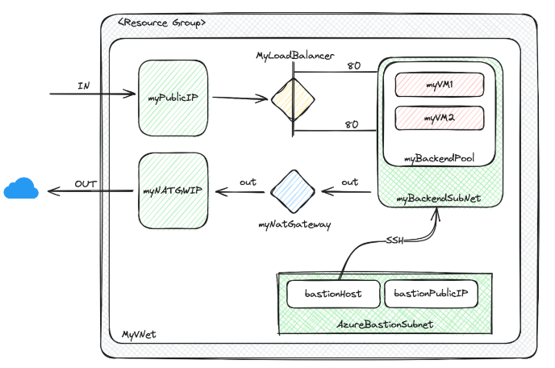
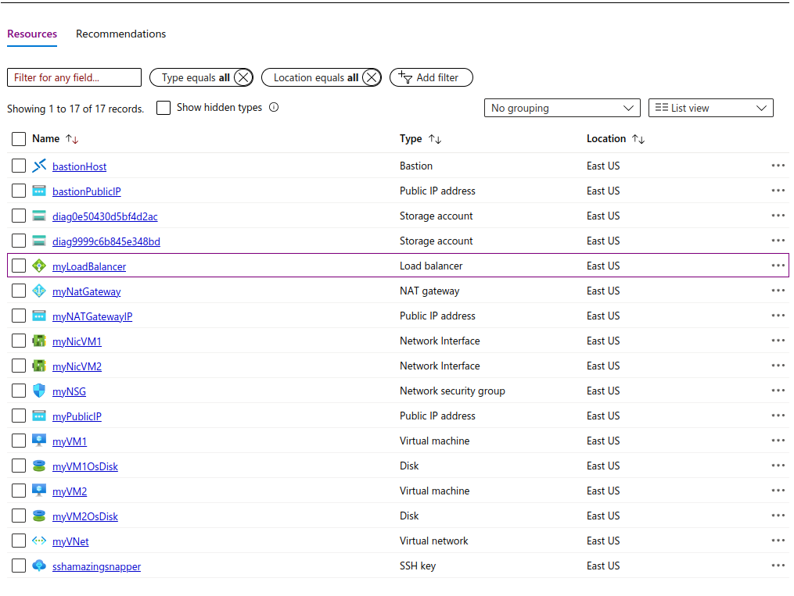

# puc_devops_iac_terraform_azure
**Azure Terraform project for learning purposes.**

## Pre-Requirements
- Install Terraform
- Install Azure CLI


## Infrastructure architecture:



### Goal -> Resources created (example):



## Build
- Add your credentials to terraform.tfvars or providers.tf.

- Apply: Deploy the infrastructure. After applying is complete, important information will be shown too.
``` 
terraform init
terraform plan -out main.tfplan
terraform apply main.tfplan
```

- Destroy: It will remove all created resources.
```
terraform plan -destroy -out main.destroy.tfplan
terraform apply main.destroy.tfplan
```


